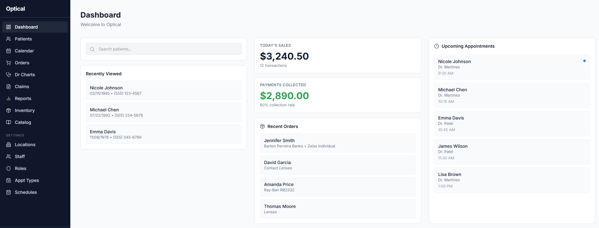

# John Evans

I use Claude Code to prototype full-stack apps.

---

## VisionOS

Practice management app for optometrists. Covers patient intake, optical orders, scheduling, clinical exams, and insurance claims.

Built this to work through multi-tenant data isolation, role-based permissions, insurance integrations, patient communications, audit logging.

**Stack:** Next.js · PostgreSQL · Clerk · Twilio ·  Vercel

# Optical Practice Management Dashboard

Lightweight prototype of an optometry practice management system focused on operational workflows (patients, orders, scheduling, and revenue tracking).
Most optical systems are fragmented across EHR, billing, and retail workflows. This prototype explores a unified dashboard for front desk and management visibility.

## Dashboard

## Overview

- Patient lookup and recent activity
- Daily sales and payment tracking
- Appointment visibility
- Order tracking across products (frames, lenses, contacts)
